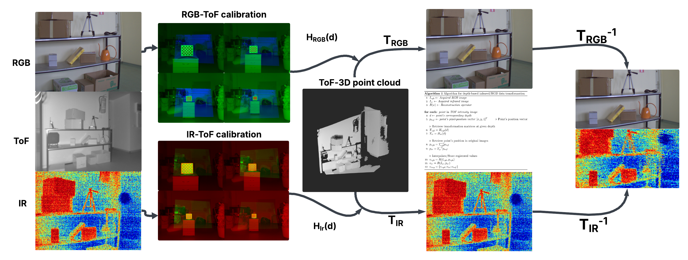

# Depth-Aware-RGB-and-IR-Image-Alignment-Using-ToF-Based-Homography-Interpolation

This repository contains Python scripts for computing depth-dependent homography transformations between camera views—specifically from IR to ToF and from RGB to ToF. These transformations help align views captured from different sensors when the scene is observed at varying depths.

## Goal

To accurately map points between camera views (such as RGB and ToF), we compute a homography matrix that depends on depth. Since calibration patterns like a chessboard can be observed at different distances, we use this to estimate how the mapping changes with depth.

We assume that each element of the homography matrix varies linearly with depth. So, we compute homographies at two known depths and fit a linear model for each element.

In our case, we captured chessboard images at 100 cm, 150 cm, 200 cm, and 250 cm.
However, to fit a linear model for each homography element, we selected the two depths: 100 cm and 250 cm. This provides a wider range for interpolation and simplifies the model to a first-order approximation.

As a follow-up, we validate the model using circular features and aim to generalize the calibration method for robust depth-dependent multi-view alignment.



## Requirements

Python libaries:
- numpy  
- opencv-python  
- matplotlib  
- scipy  
- pillow  
- imageio

## Clone and Run

```bash
git clone https://github.com/streboreziert/Depth-Aware-RGB-and-IR-Image-Alignment-Using-ToF-Based-Homography-Interpolation.git
cd Depth-Aware-RGB-and-IR-Image-Alignment-Using-ToF-Based-Homography-Interpolation
```

---

## How to Use

This section provides the full workflow for performing depth-aware RGB and IR image alignment using ToF-based homography interpolation.

### 1. Capture Calibration Images

Capture chessboard images at two or more known depths (e.g., 100 cm and 250 cm) from all three cameras: RGB, IR, and ToF (Blaze). Ensure the chessboard is clearly visible and flat in the scene.

Store the images in an organized folder structure by depth and camera type.

---

### 2. Detect Chessboard Corners

Run one of the following scripts to detect and save the 2D chessboard corner coordinates:

```bash
python Find_chessboard_corners.py
```
or
```bash
python Find_chessboard_using_adaptive_treshold.py
```

These scripts will output text or `.npy` files containing the 2D corner coordinates for each image. Make sure that corners are detected consistently across all depths and all cameras. These corner files will be used to calculate homographies.

---

### 3. Compute Depth-Aware Homography

Run the appropriate homography interpolation script depending on the camera pair:

```bash
python RGB_ToF_linear_homography.py
```
or
```bash
python IR_ToF_linear_homography.py
```

You will be prompted to enter the two reference depths (e.g., `100` and `250`). The script then:

- Loads chessboard corner data for both cameras at those depths.
- Computes homography matrices for each depth.
- Fits a linear model to each of the 9 elements of the 3×3 homography matrix.
- Outputs all equations to `linear_depth_homography.txt`.

Each equation is of the form:
```
H_ij(z) = a * z + b
```

---

### 4. Combine Corner Files Across Depths (Optional)

To generate depth plots, you may need to merge the individual corner files:

```bash
python combine_checkerboard_corners.py
```

This script produces:
- `combined_cornersB.txt` (Blaze / ToF)
- `combined_cornersI.txt` (IR)
- `combined_cornersR.txt` (RGB)

Each file includes corners from multiple depths.

---

### 5. Plot Homography Element Trends (Optional)

To visualize how each homography matrix element changes with depth, run:

```bash
python Graph_H_matrix_elements.py
```

This generates `homography_plot.png`, which includes 9 subplots (H11–H33) for both IR and RGB homographies against ToF.

---

### 6. Overlay Chessboard Alignment on ToF Frame (Optional)

To visually validate alignment at a fixed depth:

```bash
python Chessboard_overlay_using_depth_aware_homography_at_static_depths.py
```

This script overlays the warped RGB and IR chessboard corners onto the ToF frame using the computed depth-aware homographies. It visualizes:
- Colored overlays for RGB (red), IR (green), and Blaze (blue).
- Warped corner positions to verify geometric consistency.

---

### 7. Run Final Alignment Pipeline (Full Image Warping)

To align IR to RGB using per-pixel depth from a `.ply` file:

```bash
python Depth-Aware_IR_RGB_ToF_Alignment.py
```

This script performs the full transformation pipeline:
1. Loads `blaze.ply` (point cloud) and extracts (x, y, z) data.
2. Converts (x, y) to image coordinates (row, col), creating `row_col_z.txt`.
3. Interpolates a dense depth map (`interpolated_z.txt`) using edge-aware smoothing.
4. Loads the previously computed `linear_depth_homography.txt`.
5. Computes per-pixel homography for each depth using the linear model.
6. Transforms each IR pixel to RGB space using its local homography.
7. Builds a warped IR image in RGB space and fills any gaps.
8. Crops IR and RGB images to their common field of view.
9. Saves the following outputs:

   - `warped_ir_aligned_to_rgb.png`: final warped IR image in RGB space
   - `cropped_side_by_side_ir_rgb.png`: visual side-by-side comparison
   - `depth_to_ir_rgb_mapping.txt`: per-pixel map of depth + transformed coordinates

---

### Required Input Files

| File                     | Description                                        |
|--------------------------|----------------------------------------------------|
| `blaze.ply`              | ToF 3D point cloud (binary PLY, 640×480)          |
| `ir.tif`                 | 16-bit infrared image (320×240)                   |
| `rgb.tif`                | RGB image (typically 1024×768)                    |
| `linear_depth_homography.txt` | Fitted homography equations from step 3       |
| Corner files             | From chessboard detection (e.g. `corners_rgb_100.txt`) |

---

### Output Files Summary

| Output File                        | Description                                           |
|------------------------------------|-------------------------------------------------------|
| `row_col_z.txt`                    | Raw (row, col, depth) triplets from Blaze point cloud |
| `interpolated_z.txt`              | Filled-in depth map (same resolution as Blaze)        |
| `linear_depth_homography.txt`     | Linear model for each element of the 3×3 homography   |
| `depth_to_ir_rgb_mapping.txt`     | Pixel-wise transformed coordinates and depth values   |
| `warped_ir_aligned_to_rgb.png`    | Final warped IR image registered to RGB frame         |
| `cropped_side_by_side_ir_rgb.png` | Cropped side-by-side IR and RGB image comparison      |

---

Follow this complete pipeline to achieve accurate depth-aware spatial alignment of multi-modal images captured from ToF, IR, and RGB sensors.


## Script explanations 

### Convert_IR.py
Converts a 16-bit infrared image (ir.tif) to 8-bit (ir_8bit.tif) for easier display and processing.
- Reads the IR image as 16-bit grayscale.
- Normalizes values to 0–255.
- Converts to 8-bit and saves.

### Find_chessboard_corners.py
This script detects 2D chessboard corners in input images. It:
- Works with RGB, IR, or ToF images.
- Saves the corner coordinates in text files.
- Should be run first, before computing homographies.
  
### Find_chessbaord_using_adaptive_treshold.py

Interactive tool for tuning thresholding and detecting chessboard corners in IR images.

**Controls:**
- `Trackbars`: Adjust intensity thresholds
- `Enter`: Detect corners
- `s`: Save detected image and corners to file
- `q` or `ESC`: Quit

### RGB_ToF_linear_homography.py
This script computes a linear depth-dependent homography from **ToF to RGB** using the corner points at two depths (100 cm and 250 cm in our case). It:
- Loads corner files for RGB and ToF.
- Computes homographies at both depths.
- Fits a linear model for each matrix element:  
  H_ij(depth) = a + b * depth
- Saves all 9 equations (from the 3×3 homography matrix) to "linear_depth_homography.txt".

### IR_ToF_linear_homography.py
This script works exactly like the RGB version, but instead calculates homographies from **ToF to IR**. It follows the same steps:
- Load corner points for IR and ToF.
- Compute homographies at 100 cm and 250 cm.
- Fit linear models and save them to "linear_depth_homography.txt".

### Chessboard_overlay_using_depth_aware_homography_at _static_depths.py

This visualization script helps validate the homography alignment at a specific depth.
- Loads Blaze (ToF), IR, and RGB images for the selected depth.
- Loads corresponding chessboard corners.
- Computes homographies from IR and RGB to the Blaze frame.
- Warps IR and RGB onto the Blaze image.
- Creates a color-coded overlay:
  - Red: RGB
  - Green: IR
  - Blue: Blaze

- Also overlays chessboard dots:
  - Blaze (reference)
  - IR corners (after transformation)
  - RGB corners (after transformation)

 
### homography_matrix_vs_depth_plot.py

Visualizes how each element of the 3×3 homography matrix changes with depth.

- Loads chessboard corner data for Blaze (reference), IR, and RGB
- Computes homographies: IR → Blaze and RGB → Blaze
- Plots each matrix element (H11–H33) across multiple depths
- Overlay includes:
    - Green dots: IR homography values
    - Red squares: RGB homography values
    - Dashed lines show linear trends
- Saves and displays the plot as 'homography_plot.png'

### combine_checkerboard_corners.py

 Combines multiple 2D chessboard corner files into one file per camera type (Blaze, IR, RGB).
 
- Merges 5 input files per camera
- Adds a comment header for each source file
- Outputs:
     - combined_cornersB.txt
     - combined_cornersI.txt
     - combined_cornersR.txt

### Graph_H_matrix_elements.py

Visualizes how each element of the 3×3 homography matrix changes with depth for IR and RGB images aligned to a base reference.

Input Files
- combined_cornersB.txt — Base image corners  
- combined_cornersI.txt — IR image corners  
- combined_cornersR.txt — RGB image corners  

Each file must contain comma-separated 2D points, grouped by depth (e.g., 42 points per depth).

Output
- homography_plot.png — 9-panel plot showing matrix elements vs. depth

### Depth-Aware_IR_RGB_ToF_Alignment.py

This Python script aligns an infrared (IR) image to an RGB image using per-pixel depth information from a Blaze Time-of-Flight (ToF) camera. The transformation is done using **depth-dependent homography matrices**, allowing accurate multi-modal fusion.

---

## Overview of Code Functionality

### 1. Read and Parse Binary `.ply` File
- Detects the start of binary vertex data in `blaze.ply`.
- Unpacks `(x, y, z, r, g, b)` for each point.
- Converts it into `(row, col, z)` format and writes to `row_col_z.txt`.

### 2. Build and Interpolate Z-Map
- Loads `(row, col, z)` into a 2D array `z_map`.
- Filters depth values using 1st–99th percentile range.
- Interpolates missing values using **edge-aware Gaussian weights**.
- Final depth map is saved to `interpolated_z.txt`.

### 3. Compute Depth-Dependent Homographies
- Uses hardcoded coefficients for IR and RGB camera matrices.
- Each 3×3 homography matrix `H` is a function of depth `d`:
  \[
  H_{ij}(d) = a_{ij} + b_{ij} \cdot d
  \]

### 4. Map 3D Depth Points to IR and RGB Frames
- For each pixel in `z_map`, converts the 2D point using the inverse of `H_ir(d)` and `H_rgb(d)`.
- Results in `(row, col, depth, IR_x, IR_y, RGB_x, RGB_y)` saved to `depth_to_ir_rgb_mapping.txt`.

### 5. Warp IR onto RGB Space
- Loads `ir.tif` and `rgb.tif` using `PIL`.
- For each mapped coordinate, inserts IR pixel into the RGB coordinate location.
- Gaps are filled using nearest-neighbor inpainting (`scipy.ndimage.distance_transform_edt`).

### 6. Output and Visualization
- Saves full warped IR image as `warped_ir_aligned_to_rgb.png`.
- Crops both IR and RGB images to a shared field of view.
- Displays and saves a side-by-side image `cropped_side_by_side_ir_rgb.png`.

---

##Files and I/O

### Input Files
| Filename     | Description                  |
|--------------|------------------------------|
| `blaze.ply`  | Depth point cloud (640×480)  |
| `ir.tif`     | Infrared image (320×240)     |
| `rgb.tif`    | RGB image (1024×760)         |

### Output Files
| Filename                             | Description                              |
|--------------------------------------|------------------------------------------|
| `row_col_z.txt`                      | Raw Z-map (row, col, z)                  |
| `interpolated_z.txt`                | Edge-aware interpolated depth map        |
| `depth_to_ir_rgb_mapping.txt`       | Pixel-wise mapping from depth to IR/RGB  |
| `warped_ir_aligned_to_rgb.png`      | Warped IR in RGB frame                   |
| `cropped_side_by_side_ir_rgb.png`   | Cropped visual comparison                |

---

## Verification

### Detect_RGB_circles.py

This script detects circular features in an RGB image using the Hough Circle Transform.

It performs the following steps:
- Loads the RGB image in grayscale
- Applies Gaussian blur to reduce noise
- Detects circles using OpenCV's `cv2.HoughCircles`
- Draws the detected circles and their indices
- Saves the annotated image as `rgb_circles.png`
- Outputs circle information (center and radius) to `detected_circles.txt`
- Displays the result using matplotlib

This tool is useful for verifying the position and shape of circular calibration objects in RGB frames.

### Detect_IR_image_circle.py

This script processes a grayscale IR image to identify the main thermal region and analyze its shape characteristics.

It performs the following steps:
- Applies Gaussian blur for noise reduction
- Uses Otsu’s thresholding to binarize the image
- Finds all external contours and selects the largest
- Computes the centroid (center of mass) of the region
- Calculates both maximum and average distances from the centroid to the contour edge
- Annotates and saves the result image with center and radius overlays
- Logs the computed shape metrics to a text file

Useful for verifying IR blob consistency, measuring heat spread, or validating warping accuracy in multi-modal sensor alignment tasks.
